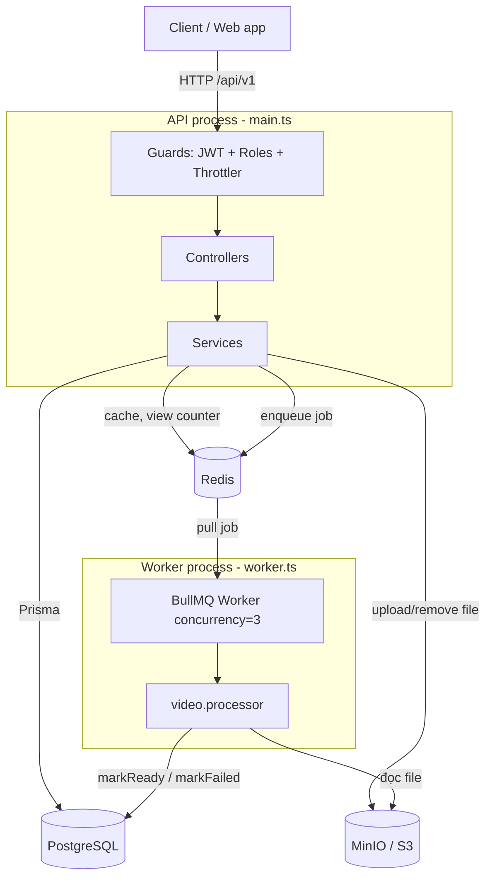
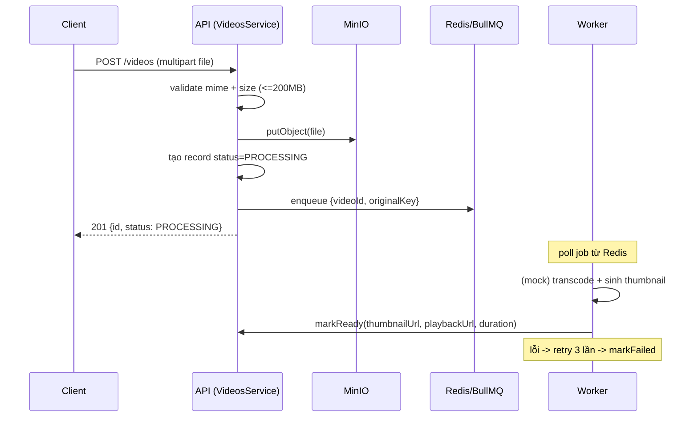
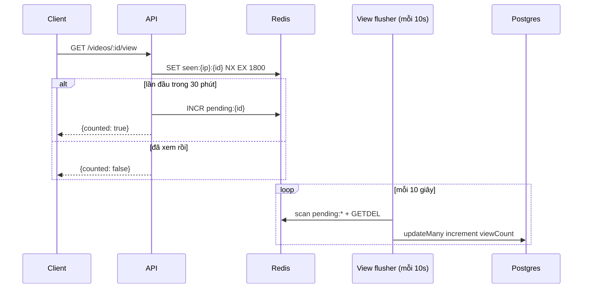
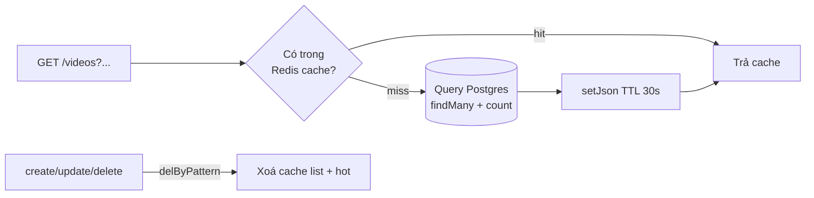

# Kiến trúc

## Tổng quan

Hệ thống chia làm 4 nhóm: client → API (NestJS) → các hạ tầng stateful (Postgres, Redis, MinIO) → worker xử lý nền. API và worker dùng **chung codebase** nhưng chạy **hai process khác nhau**.



Redis xuất hiện 2 vai trò: vừa là **cache** vừa là **message broker** cho BullMQ. Đó là lý do mũi tên "enqueue" và "pull job" đều đi qua Redis.

## Vì sao tách API và worker

`main.ts` dựng HTTP server. `worker.ts` chỉ gọi `NestFactory.createApplicationContext()` (không mở HTTP) rồi tạo `new Worker(...)` của BullMQ.

- Việc transcode nặng CPU. Nếu chạy chung trong API thì nó chiếm event loop, request HTTP khác bị chậm theo.
- Tách ra thì **scale độc lập**: traffic đọc nhiều → tăng API pod; nhiều video chờ xử lý → tăng worker pod. Hai thứ này không liên quan nhau nên không nên buộc chung một con số replica.
- Worker dùng lại được toàn bộ service (DI inject `VideosService`, `StorageService`) nên không phải viết lại logic.

## Luồng 1 — Upload video



Điểm mấu chốt: API **trả response ngay** sau khi đẩy job, không đợi xử lý xong. Client biết kết quả bằng cách poll `GET /videos/:id` cho tới khi `status` chuyển `READY` hoặc `FAILED`.

Producer cấu hình job (`video.producer.ts`):

```
attempts: 3
backoff: exponential, delay 2000ms   // 2s, 4s, 8s
removeOnComplete: 1000               // chỉ giữ 1000 job xong gần nhất
removeOnFail: 5000
```

> Phần transcode trong `video.processor.ts` hiện là mock (delay + thumbnail picsum). Chỗ thay bằng ffmpeg thật chỉ nằm trong hàm `processVideoJob`, không động tới phần queue/worker xung quanh.

## Luồng 2 — Đếm view (chống ghi DB mỗi request)



Ý tưởng: thay vì mỗi view ghi 1 dòng DB, ta **gom view trong Redis** rồi flush theo lô. Một video hot có 10.000 view/10s sẽ chỉ tạo **1 lệnh UPDATE** thay vì 10.000.

- Dedupe bằng `SET NX EX 1800`: cùng một IP xem lại trong 30 phút không tính thêm.
- `GETDEL` là atomic (đọc + xoá), nên flush không sợ mất view đang được tăng song song.
- Khi đọc chi tiết video, service cộng thêm phần `pending` trong Redis vào `viewCount` để số không bị trễ tới 10s.

Cron này bật bằng `ENABLE_VIEW_FLUSH=true` và **chỉ nên bật ở một process** (worker là chỗ hợp lý nhất).

## Luồng 3 — Đọc danh sách video (cache)



Cache key gồm tất cả tham số query (page, limit, sort, search, status, ownerId) để mỗi tổ hợp filter có cache riêng. TTL ngắn (30s cho list, 60s cho hot) + chủ động invalidate khi ghi → chấp nhận cũ tối đa vài chục giây, đổi lấy việc giảm tải DB cho phần đọc (vốn chiếm đa số traffic).

## Tầng request đi qua (cross-cutting)

Mọi request đi qua theo thứ tự:

1. **Helmet** — set security headers.
2. **ThrottlerGuard** — rate limit (mặc định 120 req / 60s; riêng login 10 req / 60s).
3. **JWTAuthGuard** — validate access token, trừ route gắn `@Public()`.
4. **RolesGuard** — kiểm tra role nếu route yêu cầu (`@Roles(ADMIN)`).
5. **ValidationPipe** — validate + strip field thừa khỏi body (`whitelist: true`).
6. Controller → Service.
7. **TransformInterceptor** — gói response thành format thống nhất.
8. **AllExceptionsFilter** — bắt lỗi, trả error format thống nhất.

Toàn bộ đăng ký ở `app.module.ts` dưới dạng `APP_GUARD` / `APP_FILTER` / `APP_INTERCEPTOR` nên áp dụng toàn cục, không phải gắn tay từng controller.

Routing: global prefix `api` + URI versioning v1 → mọi endpoint có dạng `/api/v1/...`.
