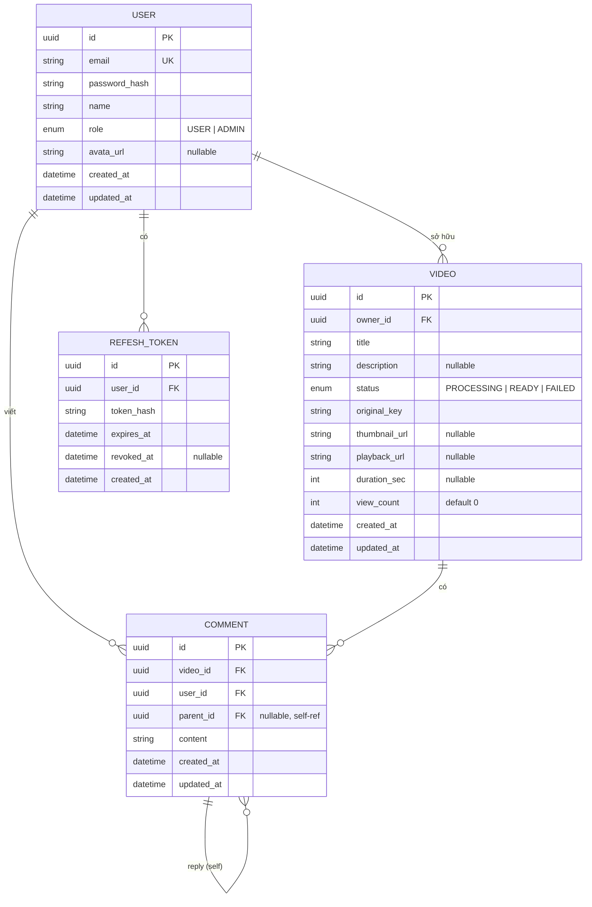

# Database

PostgreSQL, schema quản lý bằng Prisma (`prisma/schema.prisma`). Migration nằm trong `prisma/migrations/`.

## Sơ đồ quan hệ



## Các bảng

### `user`
Tài khoản. Mật khẩu lưu **hash bcrypt** (`password_hash`), không bao giờ lưu plaintext và không bao giờ trả ra response (service có hàm `sanitize` bỏ field này). `email` unique. `role` mặc định `USER`.

### `videos`
Metadata video. File thật nằm trên MinIO; DB chỉ giữ `original_key` (key trong bucket) và các URL dẫn xuất (`thumbnail_url`, `playback_url`). `status` phản ánh vòng đời xử lý:

```
PROCESSING  -> vừa upload, đang chờ/đang xử lý
READY       -> xử lý xong, xem được
FAILED      -> worker thử 3 lần vẫn lỗi
```

`view_count` được tăng theo lô từ Redis (xem [ARCHITECTURE.md](ARCHITECTURE.md)), không tăng trực tiếp mỗi request.

### `comments`
Comment có **self-reference** qua `parent_id` để làm reply lồng nhau. `parent_id = null` là comment gốc. Xoá theo cascade: xoá comment cha thì kéo theo reply.

### `refesh_tokens`
Lưu **hash SHA-256** của refresh token (không lưu token gốc). Cho phép:
- Revoke khi logout (`revoked_at`).
- Token rotation: mỗi lần refresh, token cũ bị set `revoked_at` và phát token mới.
- Hết hạn theo `expires_at`.

> Token được hash trước khi lưu nên kể cả lộ DB cũng không dùng lại được token.

## Index và lý do

Prisma sinh sẵn index cho PK và unique. Các index thêm tay:

| Bảng | Index | Phục vụ truy vấn |
|---|---|---|
| `videos` | `owner_id` | lọc video theo chủ sở hữu |
| `videos` | `created_at` | sort "mới nhất" (mặc định của list) |
| `videos` | `view_count` | sort "hot" (`orderBy viewCount desc`) |
| `videos` | `title` | tìm kiếm theo tiêu đề |
| `videos` | `status` | lọc theo trạng thái (vd chỉ lấy READY) |
| `comments` | `video_id` | list comment của một video |
| `comments` | `parent_id` | lấy reply của một comment |
| `comments` | `user_id` | comment của một user |
| `refesh_tokens` | `user_id`, `token_hash` | tra cứu lúc refresh/logout |

Mấy index trên `videos` đúng bằng các cột xuất hiện trong `WHERE`/`ORDER BY` của `VideosService.findAll`/`findHot`. Đây là phần truy vấn nóng nhất nên index trực tiếp vào đó.

> Lưu ý khi scale: tìm kiếm hiện dùng `title contains` (`ILIKE %...%`) — index B-tree không tận dụng tốt cho dạng này. Khi dữ liệu lớn nên chuyển sang Postgres full-text search (GIN) hoặc Elasticsearch, xem [SCALING.md](SCALING.md).

## Lệnh thường dùng

```bash
npm run prisma:migrate:dev    # tạo migration mới khi đổi schema (dev)
npx prisma migrate deploy     # áp migration (production, không sinh mới)
npm run prisma:seed           # seed dữ liệu mẫu
npx prisma studio             # xem/sửa data bằng UI
```

> Tên cột trong DB dùng `snake_case` (qua `@map`), còn field trong code là `camelCase`. Vài tên có typo lịch sử (`refesh_tokens`, `avata_url`) — giữ nguyên để khớp migration đã chạy, đổi tên cột là phải viết migration rename riêng.
