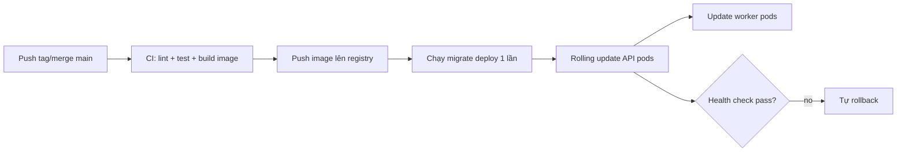
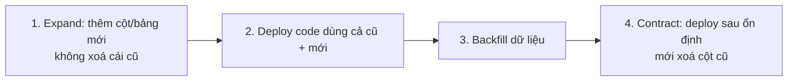

# Vận hành: Deploy, Backup, Monitoring, Logging, Rollback

## 1. Deploy production

### Build image
`Dockerfile` dùng **multi-stage build**: stage `builder` cài full deps + build TS + generate Prisma client; stage `runner` chỉ copy `dist/` + production deps (`npm install --omit=dev`) → image gọn, không kéo theo devDependencies.

API và worker **dùng chung một image**, chỉ khác lệnh chạy:
- API: `node dist/main.js`
- Worker: `node dist/worker.js`

`docker-entrypoint.sh` chạy `prisma migrate deploy` + seed khi `RUN_MIGRATIONS=true`, rồi mới start app.

### Quy trình deploy (rolling)



Nguyên tắc:
- **Migration chạy một lần, tách khỏi việc start app** (init container / job riêng), không để mỗi pod cùng chạy migrate đua nhau. Trong demo thì `RUN_MIGRATIONS` tiện cho dev; production nên tách ra một bước riêng.
- **Rolling update**: thay pod từ từ, pod mới phải pass readiness mới nhận traffic, pod cũ mới bị tắt → không downtime.
- Migration phải **tương thích ngược** (xem mục Rollback).

### Production khác demo ở đâu

| Mục | Demo | Production |
|---|---|---|
| Secrets | trong `.env`/compose | Secret manager (Vault, AWS Secrets Manager, K8s Secret) |
| TLS | không | terminate ở LB/ingress |
| Storage | MinIO local | S3/R2/GCS + CDN, bucket private |
| Bucket policy | public-read | private + presigned/CDN signed URL |
| DB | 1 container | managed Postgres (RDS/Cloud SQL) + replica + PgBouncer |
| Migration | tự chạy lúc start | bước riêng có kiểm soát |

> Trước khi lên prod nhớ **đổi toàn bộ secret mặc định** (`JWT_*`, MinIO key, DB password). App fail-fast nếu thiếu `JWT_*`/`DATABASE_URL`/`REDIS_HOST` nhưng **không** chặn được secret yếu — đó là việc của người deploy.

### Graceful shutdown
Cả API (`enableShutdownHooks`) và worker (bắt `SIGTERM`/`SIGINT`, `worker.close()`) đều shutdown êm: dừng nhận việc mới, xử lý nốt việc đang chạy rồi mới thoát. Nhờ vậy rolling update không cắt ngang job đang transcode.

---

## 2. Backup database

Đây là thứ **không được bỏ qua** — mất DB là mất tất cả metadata.

### Chiến lược
- **Automated daily backup**: managed Postgres (RDS/Cloud SQL) có snapshot tự động hàng ngày — bật + đặt retention (vd 30 ngày).
- **Point-in-time recovery (PITR)**: bật WAL archiving để khôi phục về *bất kỳ thời điểm nào*, không chỉ mốc snapshot. Quan trọng khi có sự cố xoá nhầm lúc 14:37 — restore về 14:36.
- **Backup logic định kỳ** nếu tự quản:

```bash
# dump nén
pg_dump "$DATABASE_URL" -Fc -f backup_$(date +%F).dump
# đẩy lên object storage (vùng/khu vực khác với DB)
aws s3 cp backup_$(date +%F).dump s3://my-backups/postgres/
```

### Nguyên tắc
- Backup để **ở nơi khác** với DB (khác region) — cháy một chỗ không mất cả hai.
- **Test restore định kỳ**. Backup chưa thử restore coi như chưa có backup.
- File trên object storage (S3/MinIO) nên bật **versioning** + cross-region replication — đó là backup cho phần video, tách biệt với backup DB.
- Đặt mục tiêu rõ: **RPO** (chấp nhận mất tối đa bao nhiêu data — vd 5 phút với PITR) và **RTO** (khôi phục trong bao lâu).

### Restore
```bash
pg_restore --clean --if-exists -d "$DATABASE_URL" backup_2026-06-16.dump
```

---

## 3. Monitoring


### Health endpoints (đã có sẵn)
- `GET /api/v1/health` — **liveness**: process còn sống → dùng cho orchestrator quyết định restart.
- `GET /api/v1/health/ready` — **readiness**: ping được Postgres + Redis → dùng để quyết định có route traffic vào pod chưa.

> Lưu ý: route thật là `/api/v1/health` (do global prefix + version). Cấu hình healthcheck/probe phải trỏ đúng đường này.

### Metrics nên thu (Prometheus + Grafana)
- **App**: RPS, latency p50/p95/p99, tỉ lệ lỗi 5xx, theo route.
- **Queue (BullMQ)**: độ dài hàng đợi, số job failed, thời gian xử lý job. Queue dài bất thường = worker không theo kịp → cần scale worker.
- **DB**: số kết nối, slow query, replication lag, cache hit ratio.
- **Redis**: memory, hit/miss, ops/s.
- **Hạ tầng**: CPU/RAM/disk từng pod.

### Alert
Cảnh báo theo *triệu chứng người dùng thấy*, không phải theo từng metric lẻ:
- p99 latency > ngưỡng trong X phút.
- Tỉ lệ 5xx tăng vọt.
- Queue dồn ứ (job chờ > ngưỡng) → video không bao giờ `READY`.
- `health/ready` fail (mất DB/Redis).
- Disk/RAM sắp đầy.

### Tracing
Khi scale nhiều service, thêm distributed tracing (OpenTelemetry) để lần một request đi qua API → queue → worker, tìm xem chậm ở khâu nào.

---

## 4. Logging

### Hiện trạng
Dùng **pino** (`nestjs-pino`):
- Production: JSON một dòng mỗi log — máy đọc được, hợp để ingest.
- Dev: `pino-pretty` cho người đọc.
- `autoLogging` tự log mọi HTTP request (method, path, status, thời gian).
- **Redact** sẵn `req.headers.authorization` và cookie → token không lọt vào log.

### Production
- **Tập trung log**: gom JSON log từ mọi pod về một chỗ (Loki / ELK / CloudWatch) để search/aggregate — không SSH vào từng pod.
- **Correlation ID**: gắn request ID vào mỗi log để lần trọn một request xuyên các service.
- **Log level theo env**: production `info`+, không log `debug` (như flush view) để khỏi nhiễu và tốn dung lượng.
- **Đừng log dữ liệu nhạy cảm**: mật khẩu, token, PII. Đã redact auth header; giữ kỷ luật này khi thêm log mới.
- Đặt **retention**: log nóng giữ vài tuần, cũ hơn thì archive/xoá.

---

## 5. Rollback khi release lỗi

Phân biệt rõ: rollback **code** dễ, rollback **migration DB** mới là chỗ dễ chết.

### Rollback code
Image gắn version/tag. Lỗi thì trỏ deployment về tag trước:
```bash
kubectl rollout undo deployment/api      # K8s tự về revision trước
# hoặc deploy lại image tag cũ đã biết là tốt
```
Vì image bất biến, rollback code chỉ là chạy lại bản cũ → nhanh và chắc chắn.

### Rollback database — phần dễ hỏng nhất
Nếu release vừa rồi có migration, **rollback code không đủ** — code cũ có thể không chạy được với schema mới (hoặc ngược lại).

Cách phòng: viết migration **tương thích ngược** (expand/contract pattern):



- **Không** xoá cột/đổi tên cột trong cùng release thêm tính năng dùng cột đó.
- Mỗi version code phải chạy được với schema của version liền trước → rollback code mà không cần đụng DB.
- Lỡ migration hỏng dữ liệu: dùng **PITR** (mục Backup) restore về thời điểm trước khi chạy migration.

### An toàn hơn nữa
- **Feature flag**: bật tính năng mới bằng cờ, lỗi thì tắt cờ — không cần redeploy.
- **Canary**: thả bản mới cho 5% traffic, theo dõi metric, ổn mới mở 100%; lỗi thì chỉ 5% bị ảnh hưởng.
- **Smoke test sau deploy**: gọi vài endpoint quan trọng (health, login, list video) ngay sau khi lên; fail thì auto-rollback.

### Quy trình khi production cháy
1. Khoanh vùng: lỗi từ release này hay từ hạ tầng (DB/Redis/queue)? → xem dashboard + log.
2. **Cầm máu trước, điều tra sau**: rollback code về bản tốt gần nhất ngay.
3. Nếu do migration: đánh giá có cần restore PITR không.
4. Xong sự cố mới ngồi tìm nguyên nhân gốc (post-mortem), không vừa cháy vừa debug trên prod.

---

## Tóm tắt một dòng

> Deploy bằng image bất biến + rolling update có health gate; backup DB tự động + PITR và *test restore*; monitor theo triệu chứng người dùng + alert vào queue/DB/latency; log JSON tập trung đã redact token; rollback code bằng quay về tag cũ, còn DB thì cứu bằng migration tương thích ngược + PITR.
