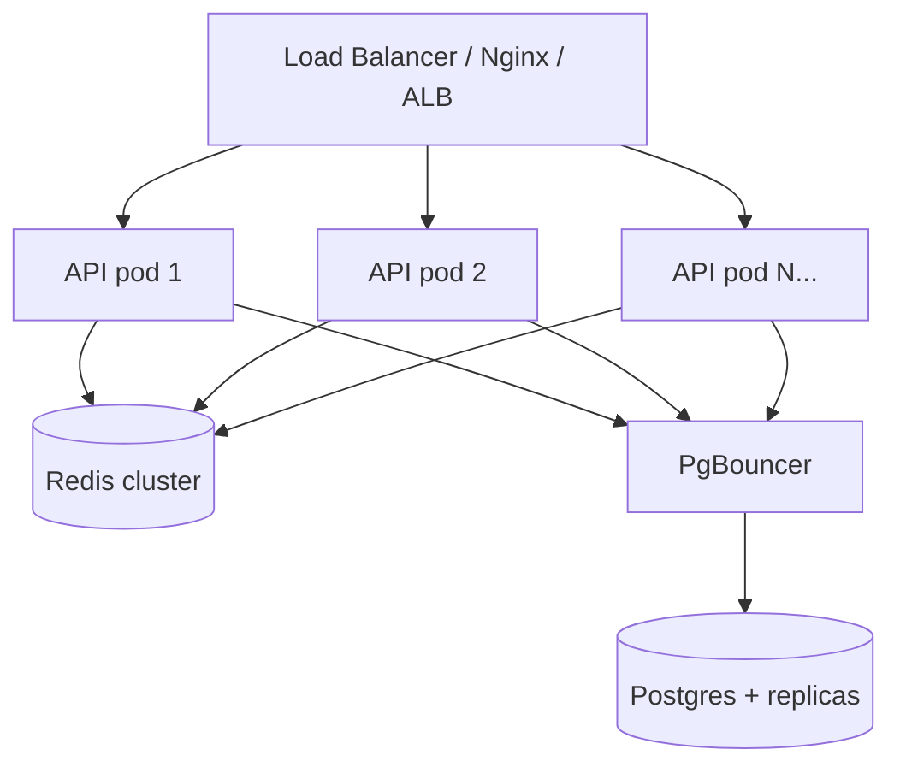
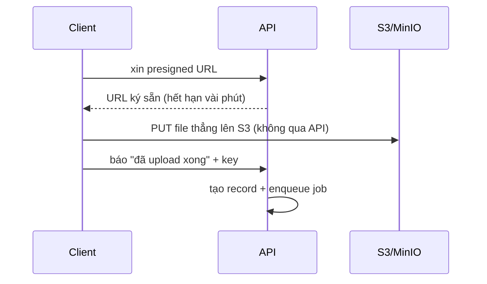

# Scale lên 1 triệu user & xử lý 100k request đồng thời

Phần này tách 2 câu hỏi vì chúng khác nhau:
- **1M user** là bài toán *dung lượng* (data lớn, storage lớn, cần tách tầng).
- **100k request đồng thời** là bài toán *concurrency* (chịu tải tức thời, không nghẽn).

Trước khi nói lý thuyết: kiến trúc hiện tại đã có sẵn vài nền tảng để scale — **stateless API** (JWT, không session dính pod), **tách worker khỏi API**, **cache Redis**, **đếm view gom theo lô**, **storage S3-compatible**. Dưới đây là cách đi tiếp từ đó.

---

## A. Xử lý 100k request đồng thời

### 1. Scale ngang tầng API
API stateless (không giữ session trong RAM, refresh token nằm ở DB/cookie) nên **nhân bản thoải mái** sau một load balancer. 100k req đồng thời chia cho N pod → mỗi pod gánh một phần.

Tự động co giãn theo CPU/RPS (HPA trên K8s, hoặc ASG). Mỗi Node process là single-thread nên chạy nhiều pod (hoặc cluster mode) để tận dụng nhiều core.

### 2. Cache để phần lớn request không chạm DB
Traffic đọc (list, hot, chi tiết video) chiếm đa số. Đã cache ở Redis. Mở rộng:
- TTL ngắn cho list (đang 30s), dài hơn cho thứ ít đổi.
- Thêm CDN trước các response GET public và trước file video → 100k request xem cùng một video hot có thể được CDN trả, không vào tới API.
- Đọc chi tiết video có thể cache thêm nếu cần (hiện chưa cache để số view real-time).

### 3. Đừng ghi DB mỗi request — đã làm với view
Cơ chế đếm view (Redis counter + flush lô 10s) chính là để chịu tải ghi cao. Một video viral 100k view không tạo 100k UPDATE mà gom lại còn vài chục. **Pattern này áp được cho mọi counter** (like, share...).

### 4. Connection pool cho DB
Postgres không chịu được hàng chục nghìn kết nối trực tiếp. Đặt **PgBouncer** ở giữa: hàng nghìn client app → vài trăm kết nối thật tới Postgres. Đây là nút thắt hay bị quên nhất khi scale Node + Postgres.

### 5. Upload phải chuyển sang presigned URL (quan trọng)
Đây là **giới hạn lớn nhất hiện tại**: upload đang buffer cả file vào RAM của API (multer memory storage). 100 người upload file 200MB cùng lúc = 20GB RAM, sập.

Cách đúng:

API không cầm byte nào của file → upload không còn là nút nghẽn, scale gần như vô hạn theo S3.

### 6. Rate limit & backpressure
Throttler đã có (mặc định 120/60s). Khi tải cao cần rate limit phân tán (lưu counter ở Redis thay vì RAM từng pod) để giới hạn đúng trên toàn cụm. Thêm timeout + circuit breaker để khi DB chậm thì fail nhanh thay vì dồn ứ.

---

## B. Scale lên 1 triệu user

### 1. Database: replica + đọc/ghi tách
- **Read replica**: route các truy vấn đọc (list, hot, profile) sang replica, chỉ ghi vào primary. Phần đọc của hệ này nhiều hơn ghi rất nhiều.
- **Index** đã đặt đúng các cột nóng (xem [DATABASE.md](DATABASE.md)). Theo dõi slow query log, thêm index khi cần.
- **Partition** bảng lớn theo thời gian khi `videos`/`comments` lên hàng trăm triệu dòng.
- Xa hơn: sharding theo `userId` nếu một cụm không đủ — nhưng đây là bước cuối, tránh sớm.

### 2. Tìm kiếm tách khỏi Postgres
`title contains` (ILIKE) không scale. Ở mức triệu video:
- Bước 1: Postgres full-text search (GIN index) — đủ cho đa số.
- Bước 2: Elasticsearch/OpenSearch nếu cần search nâng cao (typo, ranking, facet). Đồng bộ từ DB qua queue.

### 3. Worker pool co giãn theo độ dài queue
Triệu user → rất nhiều video chờ xử lý. Worker tách riêng nên **scale độc lập với API**: auto-scale số worker theo độ dài hàng đợi BullMQ (queue dài thì thêm worker). Tách queue theo loại job nếu cần ưu tiên (transcode vs sinh thumbnail).

### 4. Storage + CDN
- File lên thẳng object storage (S3/R2/GCS) — vốn đã thiết kế cho petabyte.
- **CDN bắt buộc** cho phát video: đẩy bandwidth ra biên, gần người dùng, giảm tải gốc. Production nên private bucket + CDN ký URL thay vì public-read như demo.
- Transcode thật ra HLS nhiều độ phân giải để adaptive bitrate.

### 5. Redis cũng phải scale
Một node Redis có giới hạn. Lên Redis Cluster (sharding key) hoặc tách vai trò: một cụm cho cache, một cụm cho BullMQ, để job nặng không đụng cache.

### 6. Quan sát được hệ thống
Triệu user thì không thể debug bằng cảm tính. Cần metrics + log tập trung + tracing để biết nút nghẽn nằm đâu — xem [OPERATIONS.md](OPERATIONS.md).

---

## Lộ trình thực tế (đừng làm hết một lúc)

| Mức | Việc cần làm | Vì sao lúc này |
|---|---|---|
| **Bây giờ** | Presigned upload, PgBouncer, CDN cho video | Gỡ 3 nút nghẽn rõ nhất: RAM upload, connection DB, bandwidth |
| **~100k user** | Nhiều API pod + auto-scale, rate limit phân tán, read replica | Bắt đầu có tải đọc thật |
| **~1M user** | Tách search engine, partition bảng, Redis cluster, worker auto-scale theo queue | Data và throughput vượt ngưỡng một node |

> Nguyên tắc: **đo trước khi tối ưu**. Mỗi bước trên chỉ làm khi metric chỉ ra đúng nút nghẽn đó, không scale sớm cho vui.
